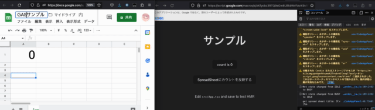

# お膳立て for Google Apps Script (React App built by Vite)

SpeadSheetのGoogle Apps ScriptコンテナバインドスクリプトでWebアプリを作るのを想定している。



from [react-vite-ozendate](https://github.com/halllllll/react-vite-ozendate) base menu

## background knowledges,　libraries, tools or envs
- Devcontainer
- node
- Bun
- Biome
- React
- react-router
- TypeScript
- Vite
- clasp
  - [https://codelabs.developers.google.com/codelabs/clasp/#0](https://codelabs.developers.google.com/codelabs/clasp/#0)
## more
フロント側は`vite`（`rollup`）で、GAS側は`es-build`でそれぞれ別個にビルドする。フロントは`vite-plugin-singlefile`、GASは`esbuild-gas-plugin`でシングルファイルにまとめている。

フロントからGAS側で定義した関数を呼ぶために`gas-client`を使って外に出している。また、フロント側の型定義ファイルで`Google`を定義し、`gas-client/src/utils/is-gas-environment`でローカルかGAS環境かを判定している


- clasp, @types/google-apps-script
- [enuchi/gas-client](https://github.com/enuchi/gas-client)
- [richardtallent/vite-plugin-singlefile](https://github.com/richardtallent/vite-plugin-singlefile)
- [mahaker/esbuild-gas-plugiin](https://github.com/mahaker/esbuild-gas-plugin)

追加したツールに伴ってコード中の相対リンクや各種設定ファイルを変更している。

Webアプリ側(`vite.config.ts`)およびSpreadsheet側のカスタムメニュー用のhtml（`vite.config.menu.ts`）の両方をビルドする。

## usage

preview with `HMR`
```
bun dev --port=xxxx
```
この場合、メニューの画面は`localhost:xxxx/src/server/Menu/menu.html`で見れる


prepare and deploy
```
clasp login
clasp create --type sheets
bun run build
bun run push
clasp open
```
